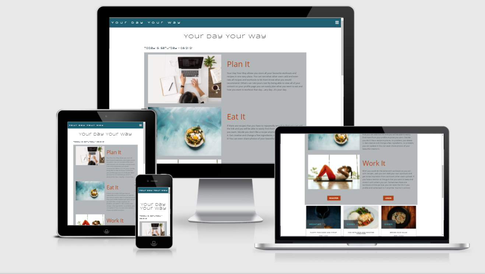
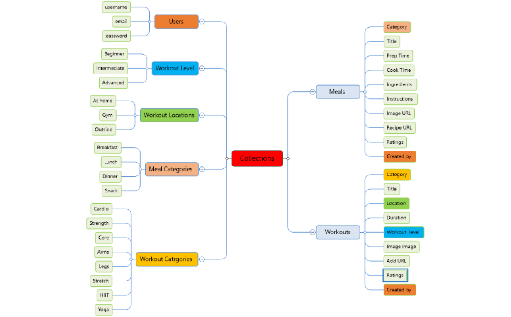
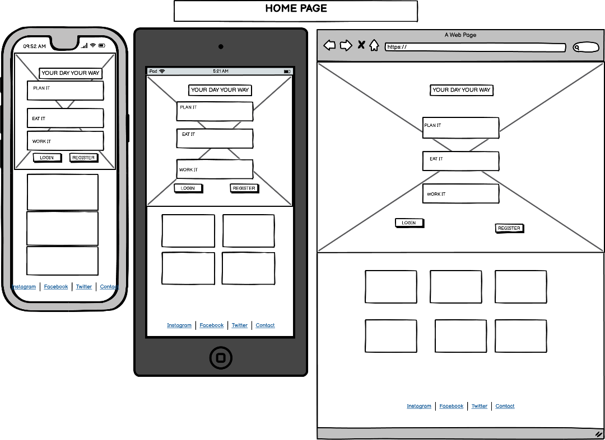
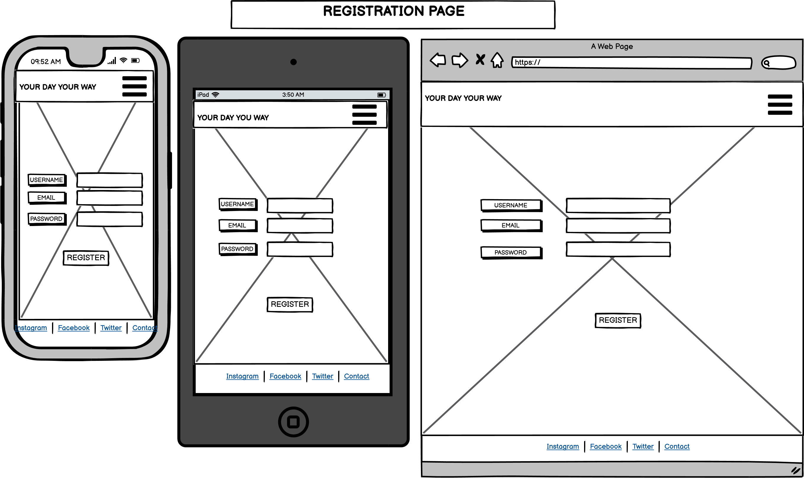
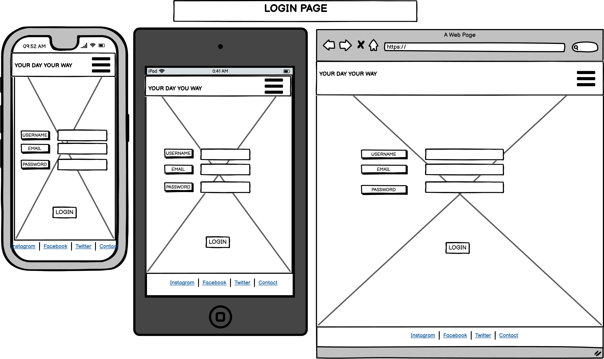
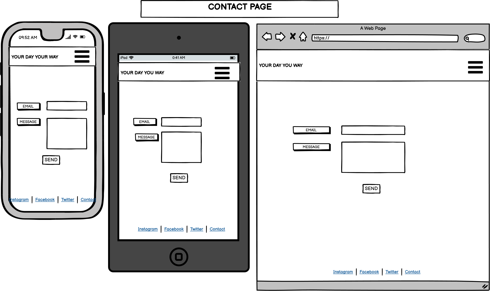

# Your Day, Your Way

- [Your Day, Your Way](#your-day-your-way)
  - [About](#about)
  - [UX](#ux)
    - [Strategy](#strategy)
    - [Target Audience](#target-audience)
    - [User Stories](#user-stories)
    - [Site Goals](#site-goals)
  - [Scope](#scope)
    - [Planned features: Backend and frontend development](#planned-features-backend-and-frontend-development)
  - [Structure](#structure)
    - [Database Schema](#database-schema)
  - [Validation and Security](#validation-and-security)
    - [Backend environment:](#backend-environment)
  - [Features](#features)
    - [Design](#design)
    - [Skeleton](#skeleton)
      - [Wireframes](#wireframes)
      - [Home](#home)
      - [Register](#register)
      - [Log In](#log-in)
      - [Profile](#profile)
      - [Meals](#meals)
      - [Workouts](#workouts)
      - [Contact](#contact)
  - [Features](#features-1)
  - [Design](#design-1)
    - [Typography](#typography)
  - [Imagery](#imagery)
    - [Alterations to design](#alterations-to-design)
  - [Features left to implement](#features-left-to-implement)
  - [Testing](#testing)
  - [Technologies](#technologies)
  - [Configuration](#configuration)
    - [MongoDB](#mongodb)
    - [Cloudinary](#cloudinary)
  - [Deployment to Heroku](#deployment-to-heroku)
    - [Create application:](#create-application)
  - [Forking](#forking)
  - [Cloning](#cloning)
  - [Credits](#credits)
    - [Content](#content)
    - [Code](#code)
    - [Acknowledgements](#acknowledgements)

<small><i><a href='http://ecotrust-canada.github.io/markdown-toc/'>Table of contents generated with markdown-toc</a></i></small>

## About
Your Day Your Way is intended to help user’s share healthy meals and workouts. Alongside accessing meals and workouts on the site, users can add their own favourite meals and workouts to the database and easily access them from their profile. It is a site to allow the simple and easy storage of all user workouts and meals in one easily accessible place so they can plan their meals and workouts the way they want them to be!
## UX
### Strategy 

### Target Audience
The target audience for this site are adults that would like to improve their health through improved diet and increased exercise. Anyone that would like to store their favourite meals and workouts in one easy place building up a reference library of their very own. This site would also benefit those that can feel overwhelmed by the variety of options available to them from multiple sources.
### User Stories
1.	I would like to understand the sites purpose.
2.	I would like to understand what the site offers so I can make an informed decision around whether register or not.
3.	I want the registration process to be simple.
4.	I would like logging in and logging out to be easy.
5.	I would like the sites navigation to be intuitive.
6.	I expect appropriate feedback from interactive elements.
7.	I would like to upload my own images.
8.	I want to be able to add, edit and delete my own content.
9.	I would like to access my own content from my profile page.
10.	I would like to be able to contact the site admin.
11.	I would like to view content uploaded by everyone.
12.	I would like to add my own as well as other site users’ content to my profile.
13.	I would like to be able to delete my account.

### Site Goals
- To allow users to add their own meals and workouts. 
- Encourage a healthier lifestyle with likeminded people.
- Allowing users to favourite the content they like and add it to their profile
## Scope
### Planned features: Backend and frontend development 
- CRUD functionality 
- Use MongoDB non-relational database to store meals and workouts 
- Use MongoDB to store all user login/profile information 
- Register user functionality 
- Login functionality
- Landing page with information on site purpose
- Navigation (not on Landing page)
- User profile 
  

## Structure
The Visio diagram below demonstrates the information architecture and flow of the site. The architecture has been designed to fulfil the user stories and scope of the project and is further elaborated in the Features and Testing sections of this project. 

### Database Schema
MongoDB non-relational database was for this project and the structure is outlined below. The data consists of several collections forming a one-to-many relationship of key/value pairs. All of the data is text based and stored as strings or arrays. The exact composition of which can be seen in the diagram below:

## Validation and Security
Validation and security measures have been put in place for:
- Email – users are unable to submit an email address that does not follow a regular email pattern. They will be notified that their entry is not valid.
- Username – must meet a minimum number of characters and fulfil the predetermined Regex pattern. The user will be notified if this pattern is not met and what the user must do to meet the requirement. On registration, incoming username’s are checked against the current usernames in the database and duplication is denied.
- Password – on entry, the password must meet the Regex pattern and minimum number of characters to be accepted. If this requirement is not met the user is notified. On acceptance, passwords are salted and hashed using werkzeug.security and securely stored in the database.
- Login – when logging in the user’s username and password must be identical to the matching records in the database. If one or both do not match the user is not informed which is incorrect, rather a flash message informs them that EITHER their username or password is incorrect. On successful login, the user is assigned a session cookie.
### Backend environment:
MongoDB, Cloudinary and Flask Mail connection details are stored in an env.py for development. For security reasons the env.py file is set to .gitignore and never pushed to GitHub. All API connection details are not visible to users and stored in Heroku throughout production.
## Features 
### Design
### Skeleton

#### Wireframes
#### Home

#### Register

#### Log In

#### Profile

#### Meals

#### Workouts

#### Contact

## Features 
- I would like to understand the sites purpose.
  - Meet criteria by having the sites purpose clearly stated on the landing page.  
- I would like to understand what the site offers so I can make an informed decision around whether to register or not.
  - The site provides a full explanation on the Home page of what it offers the user without requiring them to register.
- I want the registration process to be simple.
  - Options to register are easily accessible on the home page, either through the call to action buttons in the body or through the side navigation bar. The user is required to enter minimal information to register to the site; name, username, email and password.
- I would like logging in and logging out to be easy.
  - Once registered, the logging in page can be accessed by the Home page and side navigation bar. The user is only required to provide their username and password, which is then validated. Logging out is easily accessible through the side navigation bar and requires one click.
- I would like the sites navigation to be intuitive.
  - The site provide full access to all areas once logged in, either from the navbar or links contained on one page to other pages on the site. For example, when on the profile page, the meals page or the workouts page, there are links provided to each other to make navigation clear and simple.
- I expect appropriate feedback from interactive elements.
  - The interactions with the site are adding, editing and deleting content. As well as rating or any contact the user might wish to make with the site admin. All actions are met with confirmation of the action carried out and the update that has taken place. These take the form or Flash messages and/or page redirects. 
- I would like to upload my own images.
  - The site provides the capacity for user’s to upload their own images using a third party API
- I want to be able to add, edit and delete my own content.
  - Users have the option to add two different kinds of content, meals and workouts. This can be edited and deleted at the user’s whim. 
- I would like to access my own content from my profile page.
  - All of the content the user uploads is automatically added to their profile and divided up into the two grouping of Meal’s and Workout’s. 
- I would like to be able to contact the site admin.
  - It is not a requirement for anyone to be a registered user to contact the site. The Contact Us links in the side navbar and Footer are accessible to any site visitor. Email confirmation is provided when making contact.
- I would like to view content uploaded by everyone.
  - As well as each users content being added to their profile, it is also available for all users to see on the Meals and Workouts pages. Although only the content owner can edit or delete their own content but all users can provide ratings.
- I would like to add my own as well as other site users’ content to my profile.
  - Although not available to the user at this time, it is intended to be a Feature for future release

## Design

The site has a simple design with few contrasting colours. It is meant to reflect an uncomplicated approach to organising your favourite meals and workouts. The colours are intended to be calming but pleasing to the eye. The colour palette is below:

### Typography
The site uses Syncopate for all headings and Open Sans for the body with a fallback of Arial and san-serif. 

## Imagery
All of the imagery on the site comes from [Unsplash](https://unsplash.com/) and all are food and workout related. Images were chosen and uploaded through the site itself to be hosted on Cloudinary. The imagery on the site will be uploaded by the users.

### Alterations to design
The developer decided to scale the project back and delayed it's functionality for the time being. The biggest overall change in design was changing the landing page and replacing it with a static presentation rather the initial video.

## Features left to implement

- Providing user with a Planner functionality that will allow them to select their meals and workouts for the week ahead.  
- Allow users to add meals and workouts from all users to their Planner and generate a shopping list.
- Improving the search capability of the site  

## Testing

## Technologies
- [HTML5](https://en.wikipedia.org/wiki/HTML5) – used to complete the structure of the site.
- [CSS3](https://en.wikipedia.org/wiki/CSS) - used to style the presentation of the content on the site.
- [JavaScript](https://www.javascript.com/) & [jQuery](https://jquery.com/) - were used for front-end dynamic interaction
- [Python](https://www.python.org/) – was incorporated as the back-end logic and the means to run/view the site. 
Python Modules: 
   - dnspython==2.1.0
   - Flask==2.0.1
   - Flask-Mail==0.9.1
   - Flask-PyMongo==2.3.0
   - itsdangerous==2.0.1
   - pymongo==3.12.0
   - Werkzeug==2.0.1
- [MongoDB](https://www.mongodb.com/) - used to create the non-relational document databases (collections) and data storage for this project.
- [Materialize](https://materializecss.com/) - used through the website to assist with layout and responsiveness and incorporated JQuery functionality and form validation.
- [Cloudinary API](https://cloudinary.com/documentation/image_upload_api_reference) – installed as the means to allow the users to upload their own images.
- [Flask Mail](https://pythonhosted.org/Flask-Mail/) – used as the main form of email delivery for the site.
- [Google Fonts](https://fonts.google.com/) – provided the fonts for this site.
- [GitHub](https://github.com/join/get-started) - is the hosting platform used to store the source code for the site.
- Git - is used as version control software to commit and push code to the GitHub repository where the source code is stored.
- [Heroku](https://id.heroku.com/login) - to deploy the live website.
- [Balsamiq](https://balsamiq.com/) - was used to create wireframes for the design.
- [Font Awesome](https://fontawesome.com/) - icons displayed throughout the site are taken from Font Awesome.

## Configuration

### MongoDB 
- Create an account
- Create a new shared Cluster
- Select a Cloud provider and region relative to your area
- Name your Cluster
- Navigate to collections and add a database
- In the database access section provide a username and password for your DB

Connecting - via application
- In cluster overview click the CONNECT button.
- Select 'connect your application'
- Select the language you are using 
- Copy the connection string and change the details.
- Your connection string forms part your enviroment variables:
  
   app.config[``"MONGO_DBNAME"``] = os.environ.get(``"MONGO_DBNAME"``)
   
   app.config[``"MONGO_URI"``] = os.environ.get(``"MONGO_URI"``)
  
   app.secret_key = os.environ.get(``"SECRET_KEY"``)
    

### Cloudinary

- Create a Cloudinary Account and access your enviroment information from the Dashboard
- This information must be stored in your environment variables and accessed from your app:

    os.environ.setdefault(``CLOUDINARY_CLOUD_NAME``, ``<Your cloud name>``)
    
    os.environ.setdefault(``CLOUDINARY_API_KEY``, ``<Your API Key``)
    
    os.environ.setdefault(``CLOUDINARY_API_SECRET``,``<Your Secret Key>``)

## Deployment to Heroku

### Create application:

- Login to Heroku.
- Click on the new button.
- Select create new app.
- Enter the app name.
- Select region.

Set up connection to Github Repository:

- Set your deployment method to 'GitHub'
- Connect to GitHub and login
- Search for the repository you wish to deploy from
- Click the connect button.

Set environment variables:

Click the settings tab and then click the Reveal Config Vars button and add the following:

- key: IP, value: 0.0.0.0
- key: PORT, value: 5000
- key: MONGO_DBNAME, value: (database name you want to connect to)
- key: MONGO_URI, value: (mongo uri - This can be found in MongoDB by going to clusters > connect > connect to your application and substituting the password and dbname that you set up in the link).
- key: SECRET_KEY, value: (This is a custom secret key set up for configuration to keep client-side sessions secure).

Enable automatic deployment:

- Click the Deploy tab
- In the Automatic deploys section, choose the branch you want to deploy from then click Enable Automation Deploys.

## Forking
Forking results in a secondary branch of the site being created. The secondary branch can be worked on simultaneously without the Master Branch being altered. The steps below should be followed:

1. Log into GitHub.
2. Select your desired repository from the options to the left.
3. From the options available at the top right of the screen, which include Watch, Star and Fork, select Fork.
4. A forked branch of the repository is then created. This is a copy of the repository up to the point the forked branch was created.
5. Changes can then be made in the forked repository without those changes taking effect in the Master Branch.
6. Both repositories can be merged by selecting New Pull Request from the original repository.
## Cloning
1. Log into GitHub.
2. Select your desired repository from the options to the left.
3. From the options available just above the commit list, which include Go to File, Add File, Code and Gitpod, select Code.
4. From the HTTPS tab, copy the URL for the repository.
5. Once in your local IDE open a new terminal.
6. Chose the working directory where you would like the cloned directory to be created.
7. Type git clone into the terminal and paste the repository URL.
8. Press enter to finish the cloning process.

## Credits

### Content
All images for this site were taken from the free and open source site [Unsplash](unsplash.com). 
### Code

The developer sought guidance from various sources but credit must go to Brian Connelly for the dynamic adding of ingredients and steps.

### Acknowledgements

I'd like to acknowledge my mentor Victor for his patience and assistance. Claire Lemmonier for always being there with a solution to offer and the Slack community for 
